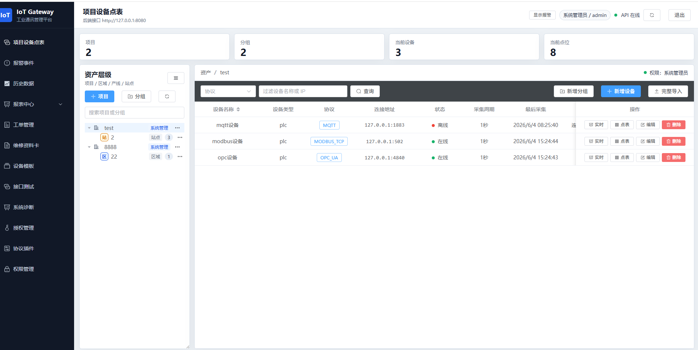
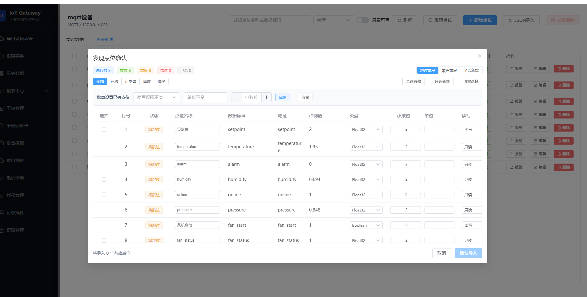
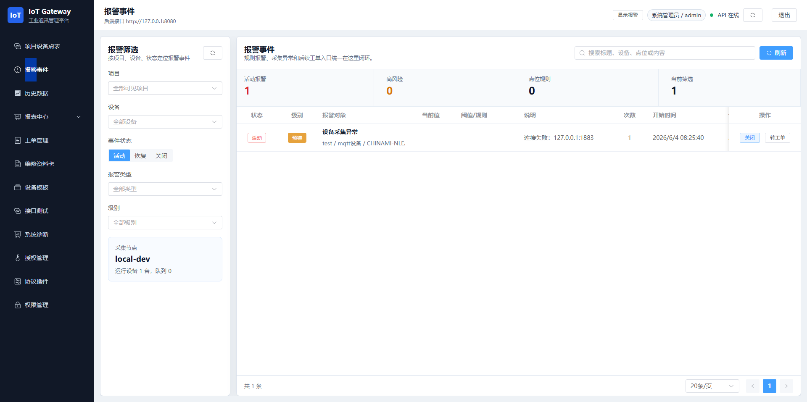
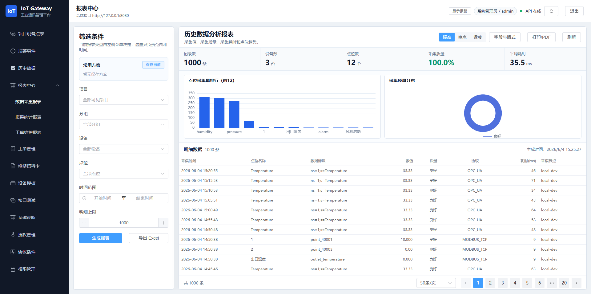
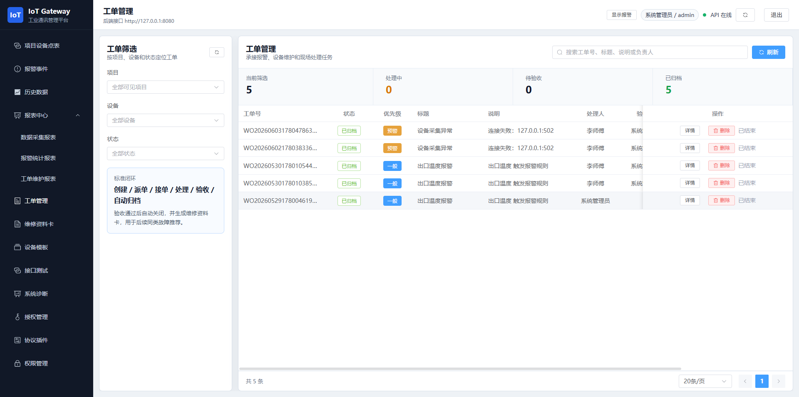
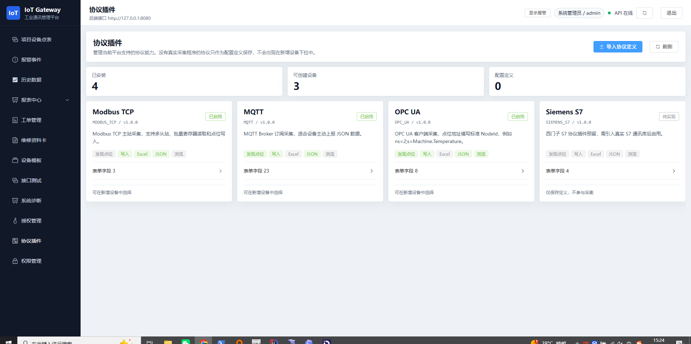

# IoT Gateway

工业通讯管理平台。当前版本面向工业网关、设备点表、实时采集、报警闭环、工单流转、维修资料归档和报表分析场景。

> 说明：本仓库建议作为公开的社区版源码仓库使用。商业授权、私有部署能力、授权校验、集群部署、部分高级协议和定制交付内容建议保留在商业版或私有仓库中。

## 页面预览

### 项目设备点表



### MQTT 点位发现



### 报警事件



### 历史数据报表



### 工单管理



### 协议插件



## 核心能力

- 资产层级：项目、区域、产线、站点分层管理。
- 设备接入：Modbus TCP、MQTT、OPC UA，协议能力由后端元数据驱动。
- 点表管理：手动新增、协议发现、JSON 导入、协议适配模板、批量删除。
- 实时数据：采集状态、实时值展示、读写权限控制、WebSocket 推送。
- 历史数据：按项目、设备、点位、时间范围查询采集历史。
- 报警系统：阈值规则、防抖延迟、恢复延迟、报警事件、转工单闭环。
- 工单系统：派单、接单、处理、验收、关闭、附件、维修资料卡归档。
- 权限系统：账号、部门、角色、项目权限、操作权限控制。
- 报表系统：历史数据报表、报警统计报表、工单维护报表、打印和导出。
- 接口测试：Swagger UI 和前端接口测试页。
- 授权管理：保留商业授权模式入口，适合后续加密狗/许可证体系扩展。

## 技术栈

后端：

- Java 8
- Spring Boot 2.7
- MyBatis Plus
- MySQL
- Modbus j2mod
- MQTT Paho
- OPC UA Eclipse Milo
- Spring WebSocket
- springdoc-openapi

前端：

- Vue 3
- Vite
- Element Plus
- ECharts
- Axios

## 项目结构

```text
iot-gateway/
  backend/              Spring Boot 后端
  frontend/             Vue 3 前端
  scripts/              本地启动、停止、模拟器脚本
  deploy/               部署相关配置
  docs/                 项目文档和截图
  docker-compose.yml    Docker 编排草案
  .env.example          环境变量示例
```

当前统一目录通过目录链接指向原始源码目录：

```text
backend  -> E:\java\iiotbackend
frontend -> E:\java\iotweb\iiot-frontend
```

## 本地启动

进入项目根目录：

```powershell
cd E:\java\iiot-gateway
```

启动前后端：

```powershell
.\scripts\start-dev.ps1
```

停止前后端：

```powershell
.\scripts\stop-dev.ps1
```

访问地址：

- 前端：http://127.0.0.1:5173
- 后端：http://127.0.0.1:8080
- Swagger：http://127.0.0.1:8080/swagger-ui/index.html

默认账号：

```text
admin / 123456
```

## 模拟器

启动 MQTT Broker、MQTT 模拟设备、OPC UA 模拟设备：

```powershell
.\scripts\start-simulators.ps1
```

停止模拟器：

```powershell
.\scripts\stop-simulators.ps1
```

默认模拟器参数：

- MQTT Broker：`127.0.0.1:1883`
- MQTT 读主题：`iiot/test2`
- MQTT 写主题：`iiot/write2`
- OPC UA Server：`opc.tcp://127.0.0.1:4840/UA/IiotTest`
- OPC UA 示例点位：`ns=1;s=Temperature`

更换 MQTT 主题：

```powershell
.\scripts\start-simulators.ps1 -MqttReadTopic "iiot/test2" -MqttWriteTopic "iiot/write2"
```

## Docker

当前 Docker 属于部署草案，正式生产部署前仍建议补齐：

- 初始化 SQL
- 生产 Nginx 配置
- 数据库备份策略
- 日志卷挂载
- 授权文件挂载
- 多采集节点部署方案

启动容器：

```powershell
.\scripts\docker-up.ps1
```

停止容器：

```powershell
.\scripts\docker-down.ps1
```

## 文档

- [系统架构](docs/architecture.md)
- [协议能力和插件边界](docs/protocols.md)
- [部署说明](docs/deployment.md)
- [GitHub 发布说明](docs/github-publish.md)
- [Gitee 发布说明](docs/gitee-publish.md)
- [公开版本和保留能力边界](docs/open-source-boundary.md)

## 仓库名称建议

建议新仓库名：

```text
iot-gateway
```

理由：

- 比 `iiot-gateway` 更通用，适合工业通讯、物联网网关、协议采集平台等场景。
- 和当前前端品牌 `IoT Gateway` 一致。
- 后续即使支持手机 App、报表、工单、授权和微服务，也不会被名字限制。

## 授权说明

本项目当前建议采用“源码可见社区版 + 商业授权保留”的方式。详细边界见 [公开版本和保留能力边界](docs/open-source-boundary.md) 和 [LICENSE.md](LICENSE.md)。

如果后续希望变成严格意义上的开源项目，可以再切换为 Apache-2.0、GPL-3.0、AGPL-3.0 等标准开源许可证。
